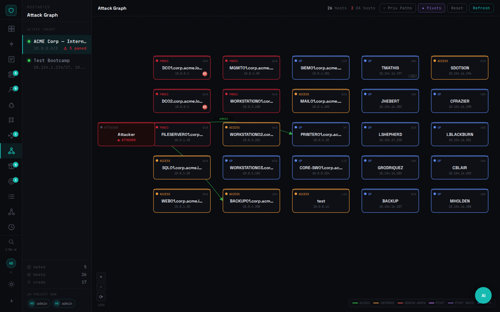
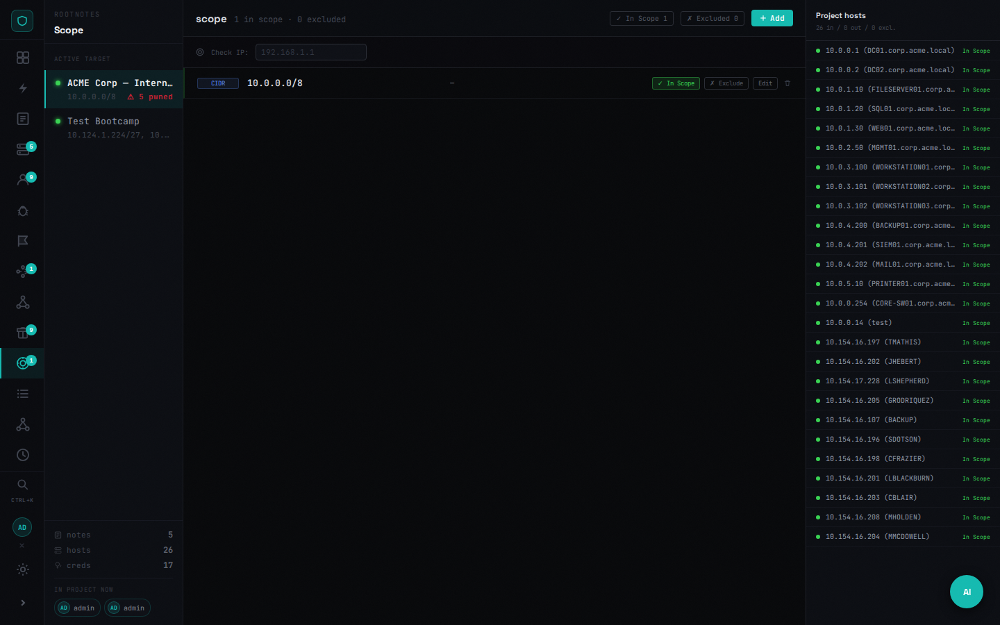
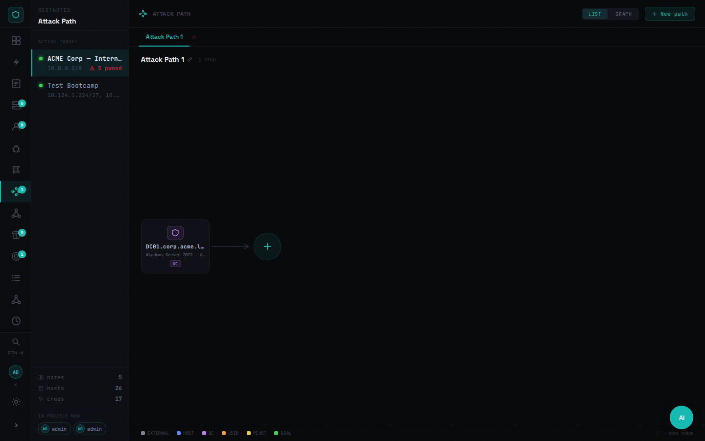
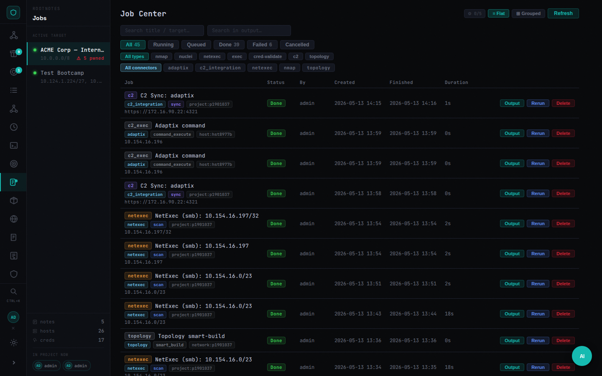
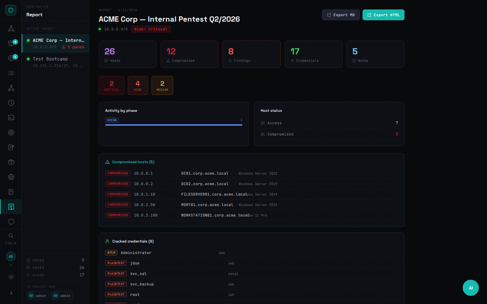
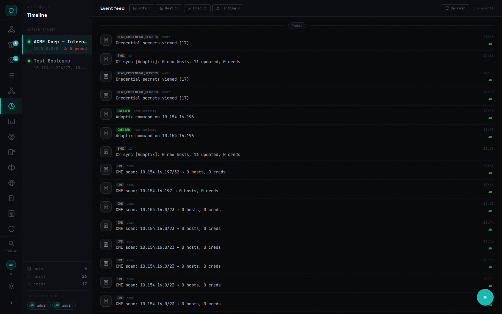

# RootNotes
> [!IMPORTANT]
> This project was developed with active assistance from AI tools.
> Code, architecture, and security decisions may require additional review before production use.

Not a note-taking app. A platform where reconnaissance, operations, evidence, and reporting live in one space — and feed each other.

---

## The problem it solves

A typical engagement runs across a dozen tools and three open terminals. Scan results live in text files. Credentials are in a spreadsheet. The network diagram is in a separate draw.io tab. Findings are in a Word document that gets updated at the end.

RootNotes puts the entire engagement state in one place:
- **Operations run from the platform**, not just logged into it
- **Results update the state** — a scan creates hosts, cred validation marks access edges, found hashes become loot
- **The graph reflects what you know right now**, not a static diagram drawn once
- **Reporting pulls from real data**, not from memory

---

## Core capabilities

### Orchestration
Run tools through the platform. Every operation is a Job with a status, output, and structured result that feeds back into the project state.

| | |
|---|---|
| **Scans** | nmap, nuclei, httpx, ffuf — via attacker SSH or global connector |
| **Bulk operations** | Execute against dynamic host collections: all Windows, all with valid SMB cred, all in subnet |
| **Credential validation** | SMB, WinRM, SSH, LDAP, MSSQL, RDP — results create access edges and finding candidates |
| **AD workflows** | SPN enum, ASREP, delegation, ADCS, BloodHound collect, domain enum |
| **C2 integrations** | Adaptix, Mythic, Sliver — pull sessions/callbacks and credentials, execute commands from the host actions panel or as a playbook step |
| **Playbooks** | Ordered operation sequences with live step polling and a dedicated `c2:exec` step |
| **Cancellation** | Running jobs can be killed — stops the subprocess, not just the DB record |

### State tracking
Operations change the project. Automatically.
- Nmap scan → hosts created/updated with ports and OS
- Cred validation → access edges in the graph, host status updated
- Job output → NTLM hashes, Kerberos tickets, secrets auto-extracted to Loot
- Structured job results → Finding candidates promoted for analyst review

### Intelligence
Everything your team needs to know about the engagement in one place.

- **Hosts** — inventory with status (`up / access / pwned`), roles, ports, services, tags, linked credentials; tabbed detail panel (Details · Activity · Creds · Path)
- **Credentials** — plaintext, NTLM, Kerberos tickets; domain/local; cracked state; host linkage
- **Findings** — severity, CVE/CVSS, proof, recommendations, MITRE IDs, workflow status
- **Notes** — Markdown with attachments, phases, tags, live collaboration
- **Knowledge Base** — Markdown articles (global or project-scoped) with full-text search
- **Attack Path** — ordered escalation steps with MITRE technique fields; link steps to real hosts
- **Scope** — CIDR/domain/hostname entries with gateway, entry-point flag, and "reachable via" pivot host

### Visualization
Two graph views showing different angles on the same engagement state.

**Network Map** — topology canvas with VLAN regions, overlay modes (Threats · Sessions · Access · Roles · Pivots), drag-and-drop layout, host inspector with activity timeline. Entry uplink edges shown in orange. Subnets accessible only via a pivot host show `⇄ via [host]` on the region.

**Attack Graph** — interactive canvas showing hosts connected by credential paths, access edges, pivot routes, and privilege escalation chains. Node badges for DA/DC status and reachability distance. Side panel shows privilege path and pivot routes for selected host.

### C2 frameworks
RootNotes integrates with three operator-side C2 frameworks. All three expose the same capability surface (sync ✓ live agents ✓ execute ✓ task history ✓) so the host actions panel and the `c2:exec` playbook step behave the same regardless of which framework holds the session.

| Framework | Transport | Auth | Notes |
|---|---|---|---|
| **Adaptix** | REST over HTTPS | username + password (or token) | Pulls hosts, agents, credentials and the BOF catalog; supports raw command line execution |
| **Mythic** | GraphQL (Hasura) | apitoken header or username/password → JWT | Pulls callbacks + credentials; `createTask` mutation for execution with optional `!command args` prefix to target a non-default Mythic command |
| **Sliver** | Native gRPC via `sliver-py` | operator config JSON (paste the file produced by `sliver-server operator --save`) | Sessions + beacons; interactive `interact_session.execute` for sessions, async beacon tasks for beacons |

Sessions appear in the host actions panel for hosts whose IP matches the agent's RemoteAddress; from there an operator can either fire a one-off command or queue a multi-step playbook against the agent.

### Pivots
- Manual pivot creation from the Network Map toolbar (tool, type, route CIDR, status)
- Auto-collection from chisel / ligolo / Adaptix via SSH collector
- Pivot route edges: all hosts in route CIDR linked to pivot node on the Attack Graph
- Scope `via_host_id`: mark a subnet as reachable only via a specific machine — Smart Build adds route edges and the region shows the pivot annotation

### Evidence pipeline
- Loot: files, hashes, secrets, configs — upload/download with auth, linked to host + job + credential
- Auto-extraction from job output: NTLM hashes, Kerberos tickets, secrets, file references
- sha256 on every upload; artifact type classification

### Reporting
Executive summary built from real project data: compromised hosts, cracked credentials, critical findings, timeline of operator activity, attack path narrative.

---

## Screenshots

### Network Map — topology canvas with VLAN regions and overlay modes


### Attack Graph — privilege paths, pivot routes, DA/DC node badges


### Hosts — tabbed panel: Details · Activity · Creds · Path


### Credentials


### Findings


### Notes (Markdown)


### Loot


### Knowledge Base


### Scope — with gateway, entry-point, and pivot host fields


### Attack Path


### Jobs


### Report


### Timeline


---

## The operational loop

```raw
Reconnaissance  →  Collections  →  Operations  →  Results
     ↑                                               ↓
  Report    ←    Intelligence   ←   Graph State  ←──┘
```

Every layer feeds the next. Data is not entered twice.

---

## Deployment

> [!IMPORTANT]
> RootNotes is designed for **internal, trusted networks** — VPN, air-gapped lab, jump host. There is no public-internet hardening (no rate-limit-by-IP on auth, no WAF, no captcha). Do not expose it directly to the internet. If you need remote access, put it behind a VPN or a reverse proxy with mTLS.

### Prerequisites

- **Docker** ≥ 24.0 with the `compose` plugin (`docker compose version` should work)
- **Linux host** with at least **2 GB RAM** and **5 GB free disk** for the database + loot artifacts
- **OpenSSL** for generating secrets (`openssl version`)
- Optional: a **separate attacker box** reachable over SSH if you want to run scans (nmap, nuclei, netexec, donpapi) — the platform doesn't ship these tools itself

### 1. Clone and enter the project

```bash
git clone https://github.com/Buthis404/RootNotes.git
cd RootNotes
```

### 2. Generate secrets

Two values must be set before any non-throwaway deployment:

```bash
# JWT signing key — sessions are issued and verified with this
openssl rand -hex 32

# Encryption key — Fernet key used to encrypt credentials, sensitive notes, loot text
python3 -c "from cryptography.fernet import Fernet; print(Fernet.generate_key().decode())"
```

Save both — you'll paste them into `.env` in the next step. Losing `ENCRYPTION_KEY` after first start makes existing encrypted data permanently unreadable. **Back it up before going to production.**

### 3. Configure `.env`

```bash
cp .env.example .env
```

Open `.env` in an editor and **fill in every value that says `change_me`**:

```ini
# Database
DB_USER=rtnotes
DB_PASSWORD=<a-strong-password>
DB_NAME=rtnotes

# Secrets — paste the generated values from step 2
JWT_SECRET=<openssl rand -hex 32 #1>
ENCRYPTION_KEY=<python3 Fernet.generate_key() #2>

# Initial admin account — auto-created on first start if no users exist
ADMIN_USERNAME=admin
ADMIN_PASSWORD=<a-strong-password>

# Host port — change if 3000 conflicts with something else
PORT=3000

# Cookie security — set true ONLY when serving over HTTPS
COOKIE_SECURE=false
```

The `.env` file is loaded by `docker compose` automatically. Never commit it — `.gitignore` already excludes it.

### 4. (Optional) Tune the worker pool

Queued jobs (nmap, nuclei, donpapi) are SSH-bound — most of the time they wait on network I/O, not CPU. The defaults are conservative:

```ini
WORKER_POOL_MAX_WORKERS=8        # total parallel jobs across all projects
WORKER_POOL_MAX_PER_PROJECT=3    # max concurrent jobs for one project
```

Bump these if your attacker box can handle more concurrent scans without rate-limiting the targets.

### 5. Build and start

```bash
docker compose up -d --build
```

First boot takes 1-3 minutes (Postgres init, frontend build, alembic migrations). Subsequent restarts are seconds.

### 6. Verify

```bash
# Core services should be Up; db/redis/backend/frontend should report healthy
docker compose ps

# Published health probe through nginx (should return 200)
curl -i http://localhost:${PORT:-3000}/health

# Tail logs in case something failed
docker compose logs backend --tail=30
docker compose logs frontend --tail=10
```

Open `http://localhost:${PORT}` and log in with the admin credentials from `.env`.

### 7. First-time setup inside the app

1. **Create a project** — left sidebar → New project
2. **Configure the attacker target** (Admin → Modules → attacker_ssh) — paste the SSH host, port, and credential the platform will use to run scans. **This is the only way scans actually run.**
3. **Invite team members** (Admin → Users) — create normal `user` accounts, then add them to projects with project-scoped roles (`owner`, `admin`, `editor`, `operator`, `viewer`, `auditor`)
4. **Optional: add C2 integrations** (Admin → Modules) — Adaptix, Mythic, Sliver

---

## Upgrading

```bash
git pull
docker compose up -d --build
```

Alembic migrations run automatically on backend start. **Always back up the PostgreSQL data volume and `data/uploads/` before upgrading across a major version.**

```bash
# Quick backup
tar -czf rtnotes-backup-$(date +%Y%m%d).tar.gz data/ .env
```

> [!IMPORTANT]
> When you rebuild the image, the **container-internal auto-generated** JWT secret regenerates if you didn't set `JWT_SECRET` in `.env`. That logs everyone out and breaks API tokens. Always set `JWT_SECRET` explicitly in `.env` for any non-throwaway install.

---

## Upgrade notes

### Versioning policy

RootNotes uses **semver-inspired** versioning (`MAJOR.MINOR.PATCH`) with one
explicit relaxation: **patch releases may include Alembic migrations** as long
as those migrations are additive (new columns, new indexes, new tables). This
matches the real-world cadence of an internal red-team tool where column
additions accompany feature patches.

**The exception that must be called out:** any migration that **deletes rows,
drops columns, or irreversibly transforms data** is considered a
_data-breaking patch_. These releases are marked **⚠ DATA** in
[CHANGELOG.md](CHANGELOG.md). Back up before upgrading to a **⚠ DATA** release.

### What each marker means

| Marker | Migration type | Safe to skip backup? |
|---|---|---|
| _(none)_ | Additive only (new columns/indexes, defaults) | Risky but usually recoverable |
| **⚠ DATA** | Deletes or transforms existing rows | **No — back up first** |

### Data-breaking releases to date

| Version | What changes | Migration |
|---|---|---|
| **v0.4.8** ⚠ DATA | Auto-deduplicates `creds` rows with identical `(pid, username, domain, host)` — duplicates permanently deleted | `006_data_stability_unique` |

### Rollback

There is no automated rollback. If a migration fails or produces unexpected
results, restore from your backup:

```bash
# Stop everything
docker compose down

# Restore DB and uploads from backup
tar -xzf rtnotes-backup-YYYYMMDD.tar.gz

# Restart (runs migrations from current state)
docker compose up -d --build
```

For individual migration rollback (advanced):
```bash
# Identify the target revision
docker compose exec backend alembic history

# Downgrade one step
docker compose exec backend alembic downgrade -1
```

Note: `downgrade()` in each migration restores schema (drops added columns)
but does **not** restore deleted rows. For **⚠ DATA** releases, downgrade
requires restoring from a DB backup.

---

## Troubleshooting

| Symptom | Cause | Fix |
|---|---|---|
| `502 Bad Gateway` from nginx after rebuilding backend | nginx cached the old backend container IP | `docker compose restart nginx` |
| `auth: 401` on every request | `JWT_SECRET` changed between restarts | Set `JWT_SECRET` explicitly in `.env`, redeploy |
| `Cannot read encrypted value` errors | `ENCRYPTION_KEY` changed after data was written | Restore from backup; encrypted columns can't be recovered without the original key |
| Frontend loads but no data | WebSocket blocked by intermediate proxy | Add `proxy_http_version 1.1` + `Upgrade`/`Connection` headers on your reverse proxy |
| Scans queued forever | No `attacker_ssh` target configured | Admin → Modules → attacker_ssh → add target |
| `alembic` migration error on startup | DB schema is ahead of the code (downgrade) | Restore DB backup or run `alembic stamp <revision>` manually |

---

## Environment variables

Full reference. All have sensible defaults; only the secrets and admin password **must** be set before production use.

| Variable | Default | Required? | Description |
|----------|---------|-----------|-------------|
| `JWT_SECRET` | *auto-generated* | **Yes** for prod | JWT signing key. Generate with `openssl rand -hex 32`. If unset, backend auto-generates and persists to `/data/.jwt_secret` — fine for local dev, not for prod. |
| `ENCRYPTION_KEY` | *generated to `/data/secret.key` if unset in dev* | **Yes** for prod | Fernet key for encrypting creds, sensitive notes, loot values, and encrypted loot files. Generate with `python3 -c "from cryptography.fernet import Fernet; print(Fernet.generate_key().decode())"`. **Back this up** — losing it makes encrypted data unreadable forever. |
| `DB_USER` | `rtnotes` | No | PostgreSQL user |
| `DB_PASSWORD` | `change_me_strong_password` | **Yes** | PostgreSQL password — change before any non-throwaway install |
| `DB_NAME` | `rtnotes` | No | PostgreSQL database name |
| `ADMIN_USERNAME` | `admin` | No | Initial admin username (only used on first boot when no users exist) |
| `ADMIN_PASSWORD` | *auto-generated* | **Yes** for prod | Initial admin password. If unset, backend prints a generated one to its log on first boot. |
| `PORT` | `3000` | No | Host port exposed by nginx |
| `COOKIE_SECURE` | `false` | No | Set `true` when serving over HTTPS so session cookies get the `Secure` flag |
| `CORS_ORIGINS` | *(empty)* | No | Comma-separated allowed origins. Empty = same-origin only |
| `WEBHOOK_HMAC_SECRET` | *(empty)* | No | If set, every webhook request must include `X-Hub-Signature-256: sha256=<hmac>` |
| `WORKER_POOL_MAX_WORKERS` | `8` | No | Total parallel queued-job slots across all projects |
| `WORKER_POOL_MAX_PER_PROJECT` | `3` | No | Max concurrent queued jobs for one project (prevents one project starving others) |

---

## Architecture

```raw
nginx ──► frontend   (React + Vite, static build)
     ──► backend    (FastAPI + SQLAlchemy + asyncio worker pool)
                └──► PostgreSQL 16
```

- **Auth:** JWT bearer tokens plus project-scoped RBAC (`owner`, `admin`, `editor`, `operator`, `viewer`, `auditor`) and global admin controls
- **Realtime:** WebSocket per-project — presence and live entity sync
- **Workers:** bounded internal async worker pool by default, optional Redis/`arq` backend for queued execution, true cancellation via cancellation token + subprocess kill
- **Storage:** uploaded files in `data/uploads/`, PostgreSQL data in the Docker volume `pgdata`
- **Execution:** attacker SSH connector or global target; SSH commands run via `Popen` with cancellation watcher thread

---

## Security

- Change `JWT_SECRET` and `DB_PASSWORD` before any non-local deployment
- Designed for internal trusted networks — no public internet exposure assumed
- All file downloads require a valid auth token (`?token=` or `Authorization` header)
- Credentials encrypted at rest
- Confidential note content is encrypted at rest when the note carries tags like `confidential`, `secret`, `sensitive`, `opsec`, or `restricted`
- Sensitive text loot values are encrypted at rest for non-file artifacts
- Read-audit events are recorded when users view credential secrets, confidential notes, sensitive loot, or download protected files
