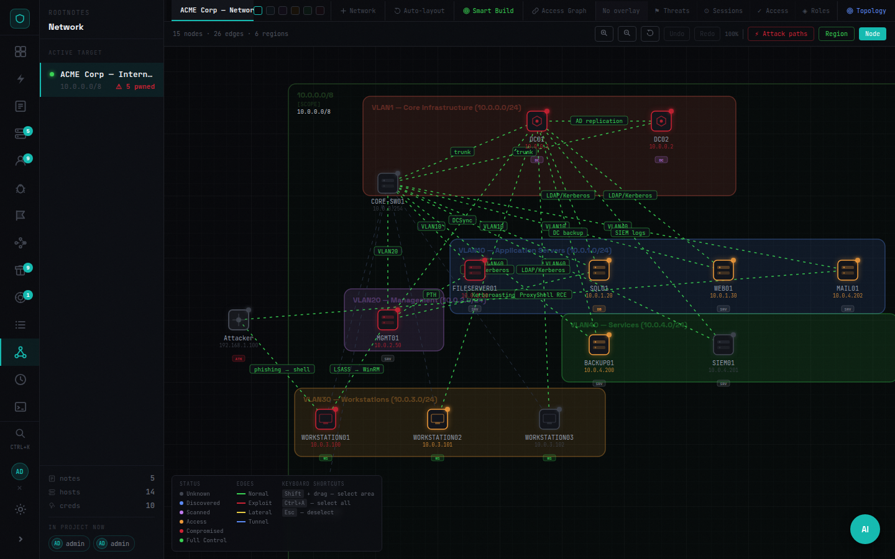
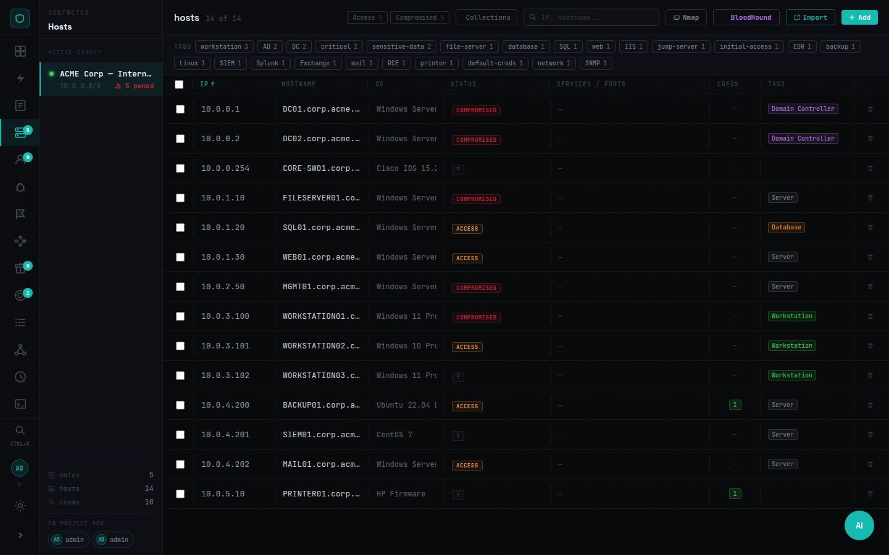
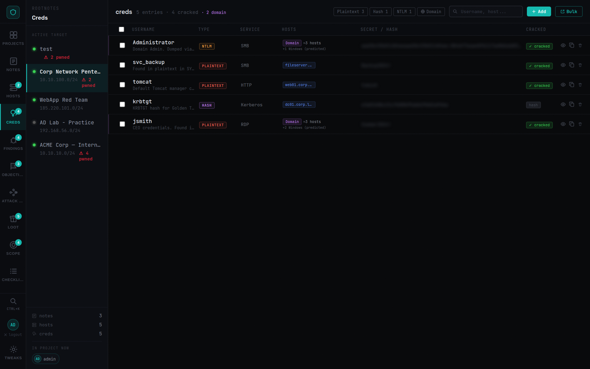
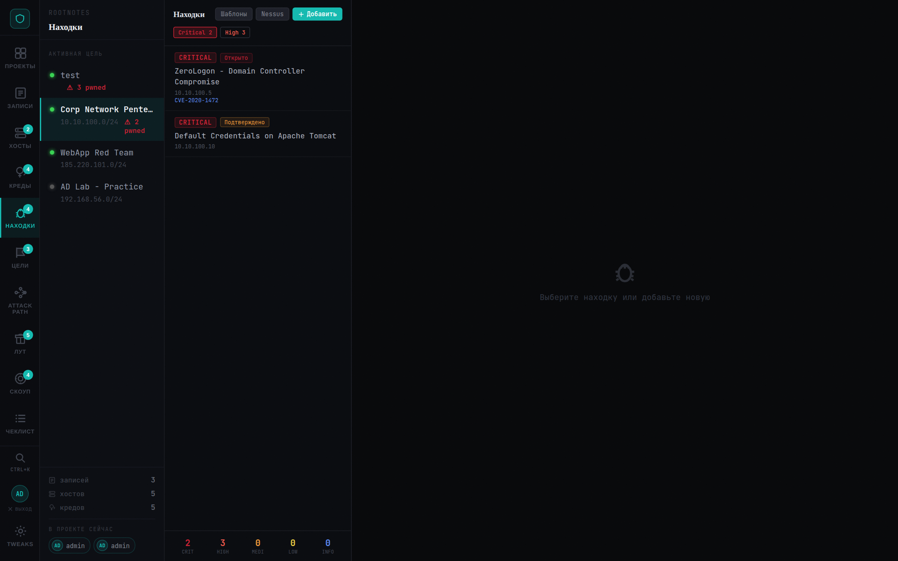
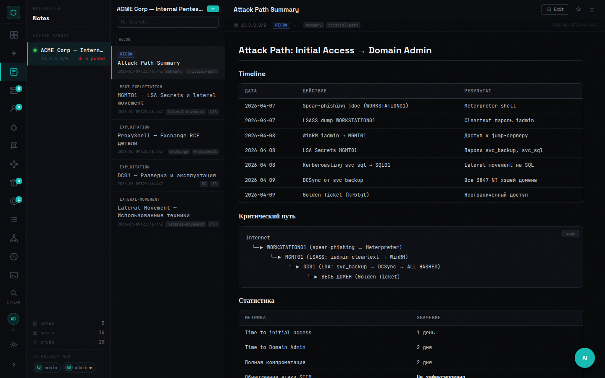
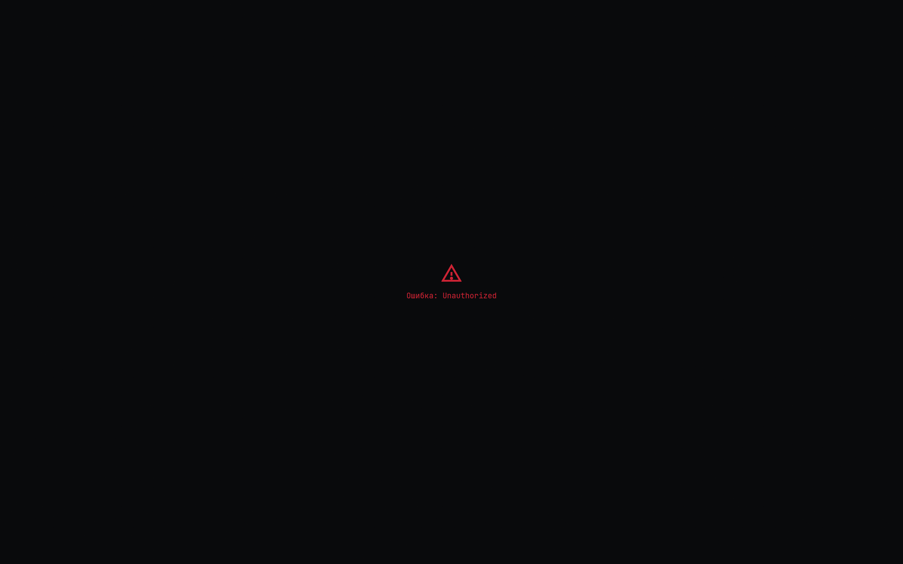
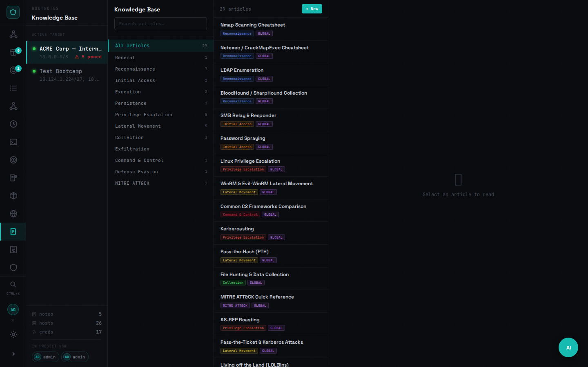
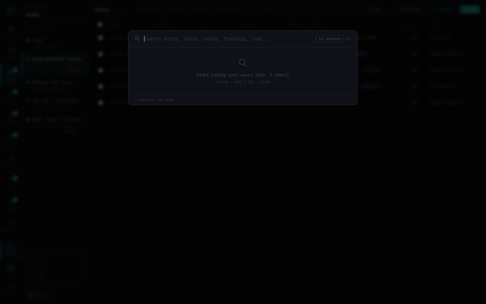
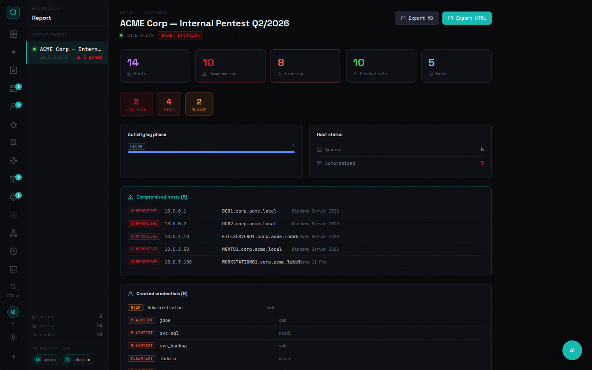

# RootNotes

**Single operational context for a pentest or red-team engagement.**

Not a note-taking app. A platform where reconnaissance, operations, evidence, and reporting live in one space — and feed each other.


---

## The problem it solves

A typical engagement runs across a dozen tools and three open terminals. Scan results live in text files. Credentials are in a spreadsheet. The network diagram is in a separate draw.io tab. Findings are in a Word document that gets updated at the end.

RootNotes puts the entire engagement state in one place:
- **Operations run from the platform**, not just logged into it
- **Results update the state** — a scan creates hosts, cred validation marks access edges, found hashes become loot
- **The graph reflects what you know right now**, not a static diagram drawn once
- **Reporting pulls from real data**, not from memory

---

## Core capabilities

### Orchestration
Run tools through the platform. Every operation is a Job with a status, output, and structured result that feeds back into the project state.

| | |
|---|---|
| **Scans** | nmap, nuclei, httpx, ffuf — via attacker SSH or global connector |
| **Bulk operations** | Execute against dynamic host collections: all Windows, all with valid SMB cred, all in subnet |
| **Credential validation** | SMB, WinRM, SSH, LDAP, MSSQL, RDP — results create access edges and finding candidates |
| **AD workflows** | SPN enum, ASREP, delegation, ADCS, BloodHound collect, domain enum |
| **Playbooks** | Ordered operation sequences with live step polling |
| **Cancellation** | Running jobs can be killed — stops the subprocess, not just the DB record |

### State tracking
Operations change the project. Automatically.
- Nmap scan → hosts created/updated with ports and OS
- Cred validation → access edges in the graph, host status updated
- Job output → NTLM hashes, Kerberos tickets, secrets auto-extracted to Loot
- Structured job results → Finding candidates promoted for analyst review

### Intelligence
Everything your team needs to know about the engagement in one place.

- **Hosts** — inventory with status (`up / access / pwned`), roles, ports, services, tags, linked credentials
- **Credentials** — plaintext, NTLM, Kerberos tickets; domain/local; cracked state; host linkage
- **Findings** — severity, CVE/CVSS, proof, recommendations, MITRE IDs, workflow status
- **Notes** — Markdown with attachments, phases, tags, live collaboration
- **Knowledge Base** — Markdown articles (global or project-scoped) with full-text search
- **Attack Path** — ordered escalation steps with MITRE technique fields; link steps to real hosts

### Visualization
Two graph views showing different angles on the same engagement state.

**Network Map** — topology canvas with VLAN regions, overlay modes (threats / sessions / access / roles), drag-and-drop layout, host inspector with activity timeline.

**Attack Graph** — interactive canvas showing hosts connected by credential paths. Drag nodes to reposition. Click any node to see linked credentials, findings that mention it, ports and services.

### Evidence pipeline
- Loot: files, hashes, secrets, configs — upload/download with auth, linked to host + job + credential
- Auto-extraction from job output: NTLM hashes, Kerberos tickets, secrets, file references
- sha256 on every upload; artifact type classification

### Reporting
Executive summary built from real project data: compromised hosts, cracked credentials, critical findings, timeline of operator activity, attack path narrative.

---

## Screenshots

### Network Map — overlay modes: Threats · Sessions · Access · Roles


### Attack Graph — interactive canvas with linked creds and findings


### Hosts


### Credentials


### Findings


### Notes (Markdown)


### Loot


### Knowledge Base


### Global Search


### Report


---

## The operational loop

```
Reconnaissance  →  Collections  →  Operations  →  Results
     ↑                                               ↓
  Report    ←    Intelligence   ←   Graph State  ←──┘
```

Every layer feeds the next. Data is not entered twice.

---

## Quick start

**Requirements:** Docker, Docker Compose

```bash
# 1. Configure
cp .env.example .env        # set JWT_SECRET, DB_PASSWORD, ADMIN_PASSWORD

# 2. Build and start
docker compose up -d --build

# 3. Open
open http://localhost:3000
```

Default credentials (printed to backend logs on first start if `ADMIN_PASSWORD` is not set):

```
admin / admin
```

---

## Environment variables

| Variable | Default | Description |
|----------|---------|-------------|
| `PORT` | `3000` | Host port exposed by nginx |
| `JWT_SECRET` | `change-me-in-production` | JWT signing key — **change before exposing** |
| `DB_USER` | `rtnotes` | PostgreSQL user |
| `DB_PASSWORD` | `rtnotes_secret` | PostgreSQL password |
| `DB_NAME` | `rtnotes` | PostgreSQL database name |
| `ADMIN_USERNAME` | `admin` | Initial admin username |
| `ADMIN_PASSWORD` | *(auto-generated)* | Initial admin password |

---

## Architecture

```
nginx ──► frontend   (React + Vite, static build)
     ──► backend    (FastAPI + SQLAlchemy + asyncio worker pool)
                └──► PostgreSQL 16
```

- **Auth:** JWT bearer tokens, role-based (`admin` / `member`)
- **Realtime:** WebSocket per-project — presence and live entity sync
- **Workers:** bounded async job pool (5 workers), true cancellation via `CancellationToken` + subprocess kill
- **Storage:** uploaded files in `data/uploads/`, database in `data/postgres/`
- **Execution:** attacker SSH connector or global target; SSH commands run via `Popen` with cancellation watcher thread

---

## Security

- Change `JWT_SECRET` and `DB_PASSWORD` before any non-local deployment
- Designed for internal trusted networks — no public internet exposure assumed
- All file downloads require a valid auth token (`?token=` or `Authorization` header)
- Credentials encrypted at rest
