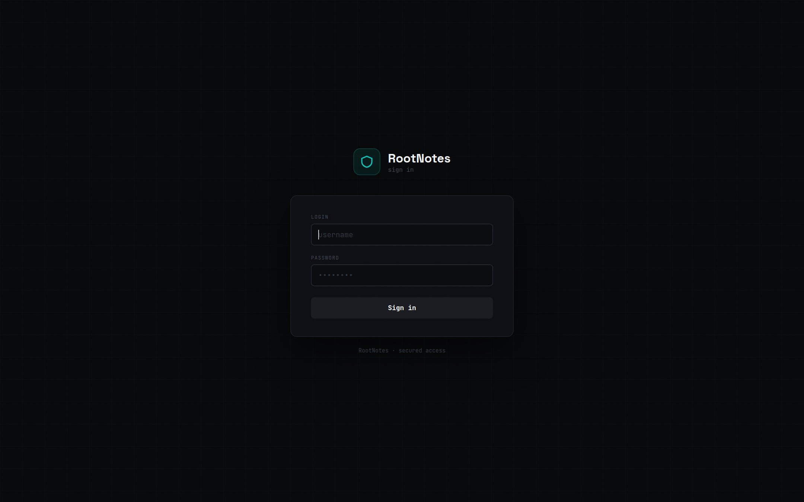
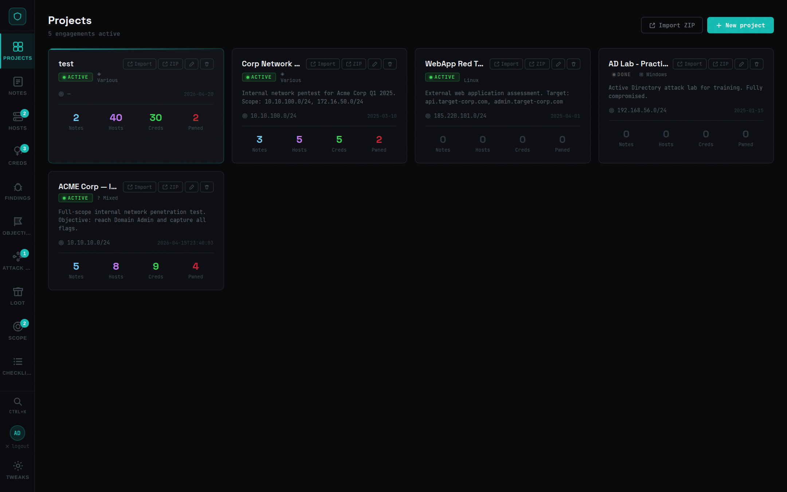
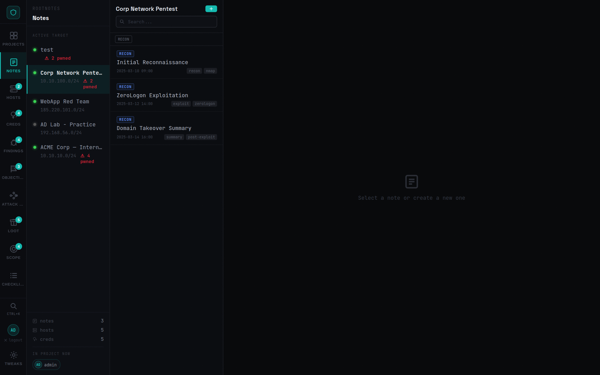
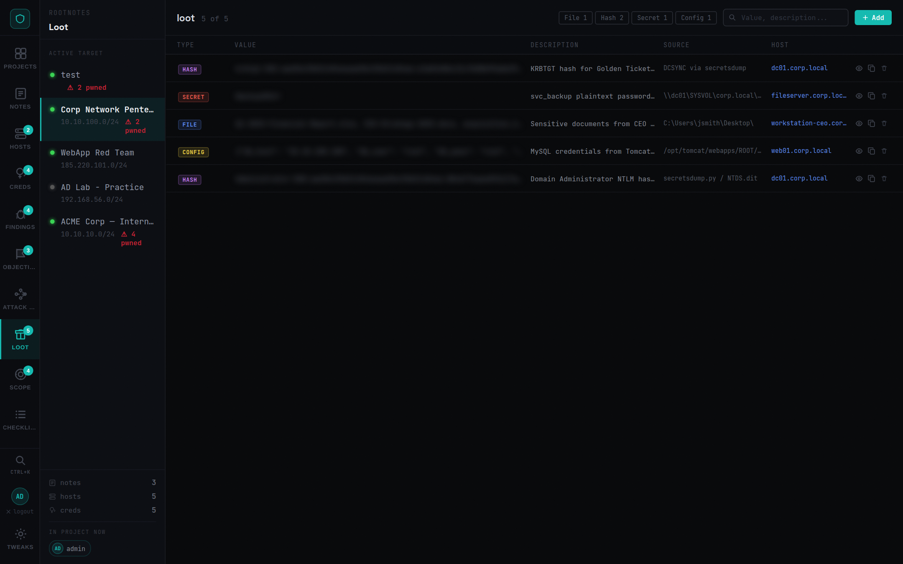
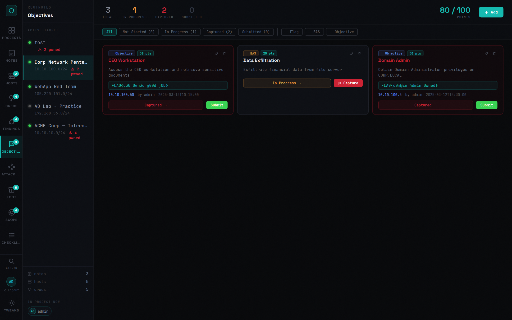
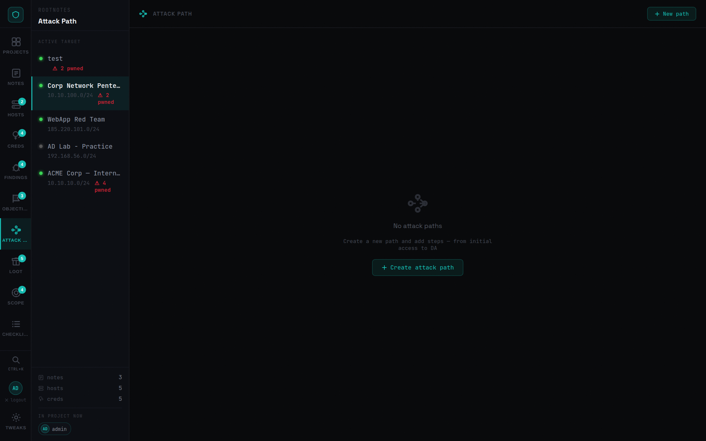
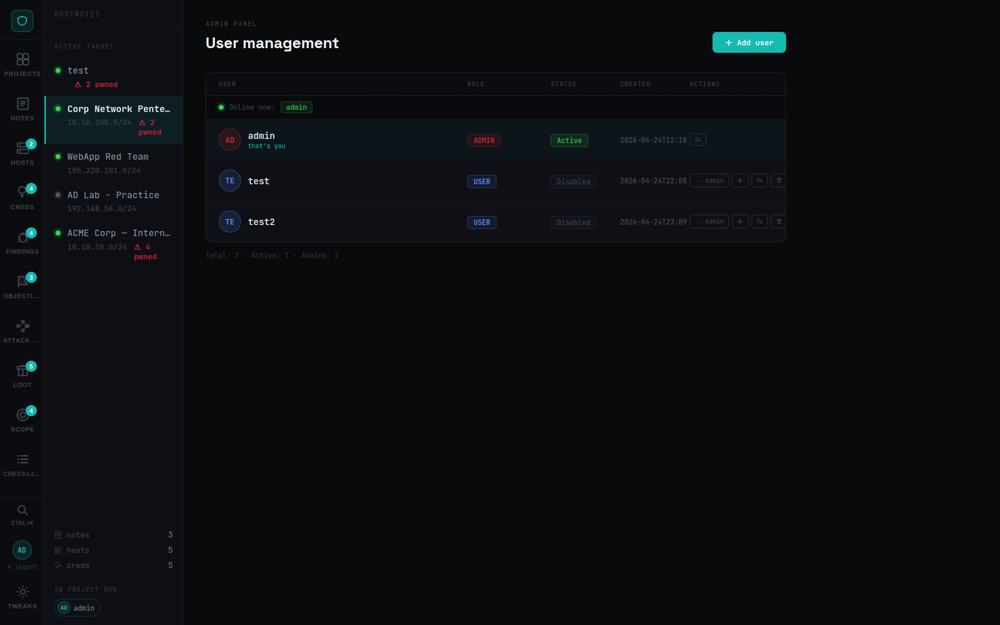
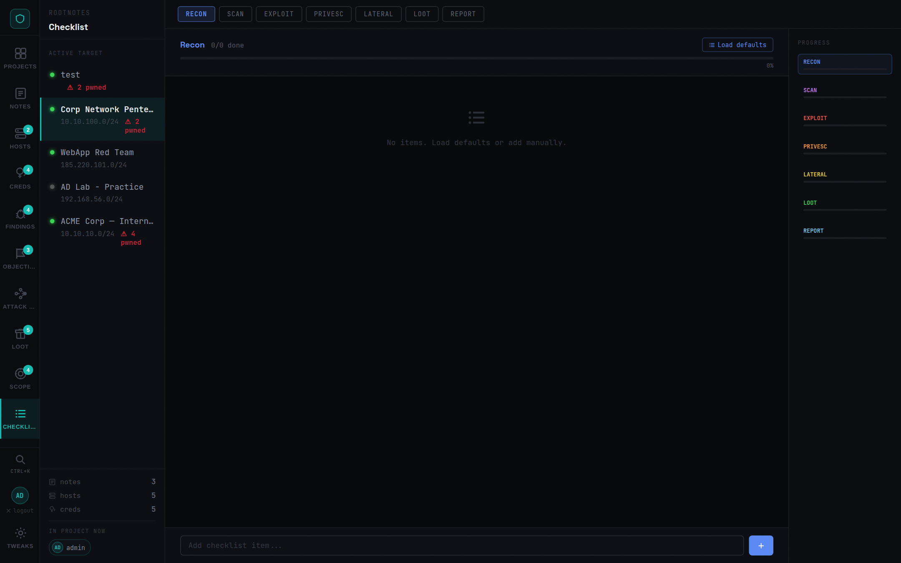
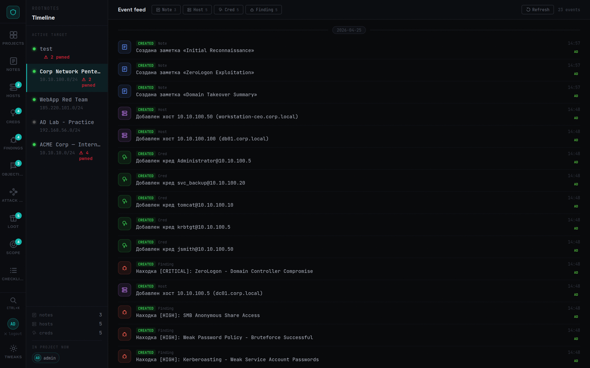

# RootNotes

RootNotes is a self-hosted red team workspace for tracking projects, notes, hosts, credentials, findings, loot, objectives, scope, and attack paths in one interface.

The project in this repository is split into:

- `frontend/`: React + Vite SPA
- `backend/`: FastAPI API with JWT auth and WebSocket sync
- `db/`: PostgreSQL init SQL
- `nginx/`: reverse proxy for frontend + API
- `docs/screenshots/`: current UI screenshots

## Screenshots

### Login


### Projects


### Notes


### Hosts


### Credentials


### Findings


### Loot


### Objectives


### Attack Path


### Global Search


### Admin


### Checklist


### Timeline


### Scope


## Features

- Multi-project workspace with status, target range/IP, OS, and description
- Markdown notes with attachments and real-time collaboration
- Host inventory with ports, services, tags, domains, and compromise state
- Credential tracking with host linking and domain credential support
- Findings management with severity, CVE, CVSS, proof, and remediation
- Objectives tracking with capture status, scoring, and operator attribution
- Attack path builder with ordered steps and MITRE technique fields
- Loot registry for files, secrets, hashes, and collected artifacts
- Scope tracking for CIDR/domain entries with in-scope flags
- Checklist and timeline modules per project
- Global search modal across stored entities
- Project ZIP export/import
- Parsers/import helpers for Nmap, Nessus, and BloodHound-related data
- Admin panel with user management and online presence
- WebSocket presence and live state sync between operators

## Quick Start

### Requirements

- Docker
- Docker Compose

### 1. Configure environment

Create `.env` in the repository root.

Example:

```env
DB_USER=rtnotes
DB_PASSWORD=rtnotes_secret
DB_NAME=rtnotes
JWT_SECRET=change-me-in-production
ADMIN_USERNAME=admin
ADMIN_PASSWORD=admin
PORT=3000
```

If no users exist, the backend creates the initial admin account automatically on startup.

### 2. Start the stack

```bash
docker compose up -d --build
```

### 3. Open the UI

Open `http://localhost:3000`.

For the demo/dev setup above, log in with:

- `admin`
- `admin`

## Default Services

- `db`: PostgreSQL 16
- `backend`: FastAPI on internal port `8000`
- `frontend`: built static SPA served behind nginx
- `nginx`: public entrypoint on host `PORT` (`3000` by default)

## Environment Variables

| Variable | Default | Purpose |
| --- | --- | --- |
| `DB_USER` | `rtnotes` | PostgreSQL username |
| `DB_PASSWORD` | `rtnotes_secret` | PostgreSQL password |
| `DB_NAME` | `rtnotes` | PostgreSQL database name |
| `JWT_SECRET` | `change-me-in-production` | JWT signing secret |
| `ADMIN_USERNAME` | `admin` | Initial admin username |
| `ADMIN_PASSWORD` | empty | Initial admin password; if empty, backend generates one |
| `PORT` | `3000` | Host port exposed by nginx |

## Main Workflows

### Create a project

1. Open `Projects`.
2. Click `New project`.
3. Fill in name, IP/CIDR, OS, status, and description.

### Track notes and evidence

1. Select a project.
2. Open `Notes`.
3. Create Markdown notes and upload attachments.

### Import scan data

1. Open `Hosts` or related import UI.
2. Use the available parser/import actions for Nmap, Nessus, or BloodHound-derived data.

### Export a project

1. Open `Projects`.
2. Click `ZIP` on a project card.

## Security Notes

- Change `JWT_SECRET` and `DB_PASSWORD` before using the app outside local/dev use.
- The app is designed for internal trusted environments.
- Uploaded files are stored under `data/uploads/`.
- Authentication is bearer-token based, and authenticated API routes are protected in backend middleware.
